---
## Front matter
title: "Отчёт по лабораторной работе №7"
subtitle: "Команды безусловного и
условного переходов в Nasm. Программирование
ветвлений."
author: "Мантуров Татархан Бесланович"

## Generic otions
lang: ru-RU
toc-title: "Содержание"

## Bibliography
bibliography: bib/cite.bib
csl: pandoc/csl/gost-r-7-0-5-2008-numeric.csl

## Pdf output format
toc: true # Table of contents
toc-depth: 2
lof: true # List of figures
lot: true # List of tables
fontsize: 12pt
linestretch: 1.5
papersize: a4
documentclass: scrreprt
## I18n polyglossia
polyglossia-lang:
  name: russian
  options:
	- spelling=modern
	- babelshorthands=true
polyglossia-otherlangs:
  name: english
## I18n babel
babel-lang: russian
babel-otherlangs: english
## Fonts
mainfont: PT Serif
romanfont: PT Serif
sansfont: PT Sans
monofont: PT Mono
mainfontoptions: Ligatures=TeX
romanfontoptions: Ligatures=TeX
sansfontoptions: Ligatures=TeX,Scale=MatchLowercase
monofontoptions: Scale=MatchLowercase,Scale=0.9
## Biblatex
biblatex: true
biblio-style: "gost-numeric"
biblatexoptions:
  - parentracker=true
  - backend=biber
  - hyperref=auto
  - language=auto
  - autolang=other*
  - citestyle=gost-numeric
## Pandoc-crossref LaTeX customization
figureTitle: "Рис."
tableTitle: "Таблица"
listingTitle: "Листинг"
lofTitle: "Список иллюстраций"
lotTitle: "Список таблиц"
lolTitle: "Листинги"
## Misc options
indent: true
header-includes:
  - \usepackage{indentfirst}
  - \usepackage{float} # keep figures where there are in the text
  - \floatplacement{figure}{H} # keep figures where there are in the text
---

# Цель работы

Изучение команд условного и безусловного переходов. Приобретение навыков написания
программ с использованием переходов. Знакомство с назначением и структурой файла
листинга.

# Задание

1. Напишите программу нахождения наименьшей из 3 целочисленных переменных a,b и c.
Значения переменных выбрать из табл. 7.5 в соответствии с вариантом, полученным
при выполнении лабораторной работы № 7. Создайте исполняемый файл и проверьте
его работу.
2. Напишите программу, которая для введенных с клавиатуры значений x и a вычисляет
значение заданной функции f(x) и выводит результат вычислений. Вид функции f(x)
выбрать из таблицы 7.6 вариантов заданий в соответствии с вариантом, полученным
при выполнении лабораторной работы № 7. Создайте исполняемый файл и проверьте
его работу для значений x и a из 7.6.

# Выполнение лабораторной работы

1. Создадим каталог для программ лабораторной работы № 7, перейдем в него и со-
здадим файл lab7-1.asm:(@fig:001)

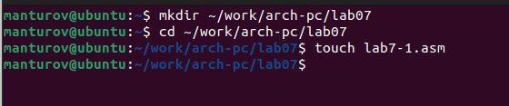{#fig:001 width=70%}

2. Инструкция jmp в NASM используется для реализации безусловных переходов. Рассмот-
рим пример программы с использованием инструкции jmp. Введем в файл lab7-1.asm
текст программы из листинга 7.1.(@fig:002)

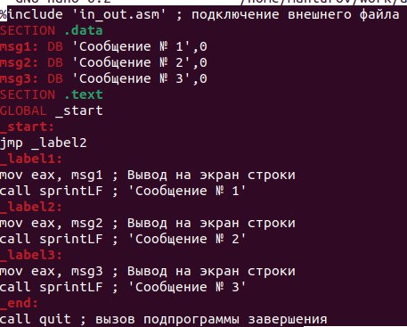{#fig:002 width=70%}

3. Создадим исполняемый файл и запустим его. Результат работы данной программы будет
следующим:(@fig:003)

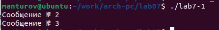{#fig:003 width=70%}

Таким образом, использование инструкции jmp _label2 меняет порядок исполнения
инструкций и позволяет выполнить инструкции начиная с метки _label2, пропустив вывод
первого сообщения.
Инструкция jmp позволяет осуществлять переходы не только вперед но и назад. Изменим
программу таким образом, чтобы она выводила сначала ‘Сообщение № 2’, потом ‘Сообщение
№ 1’ и завершала работу. Для этого в текст программы после вывода сообщения № 2 добавим
инструкцию jmp с меткой _label1 (т.е. переход к инструкциям вывода сообщения № 1)
и после вывода сообщения № 1 добавим инструкцию jmp с меткой _end (т.е. переход к
инструкции call quit). Изменим текст программы в соответствии с листингом 7.2.(@fig:004)

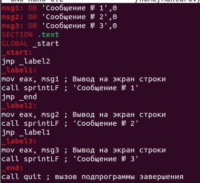{#fig:004 width=70%}

4. Создадим исполняемый файл и проверим его работу.(@fig:005)

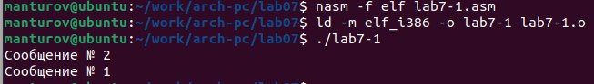{#fig:005 width=70%}

Изменим текст программы добавив или изменив инструкции jmp, чтобы вывод програм-
мы был следующим:
Сообщение № 3
Сообщение № 2
Сообщение № 1(@fig:006)

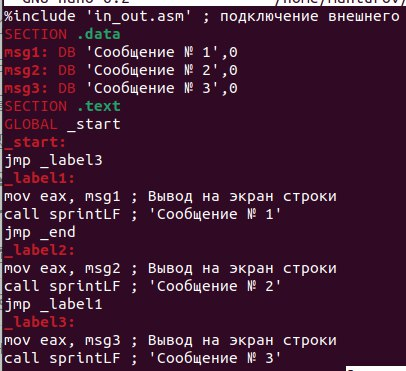{#fig:006 width=70%}

5. Создадим исполняемый файл и проверим его работу.(@fig:007)

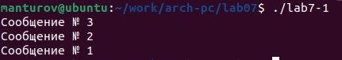{#fig:007 width=70%}

6. Создадим файл lab7-2.asm в каталоге ~/work/arch-pc/lab07. Внимательно изучим текст
программы из листинга 7.3 и введем в lab7-2.asm.(@fig:008)

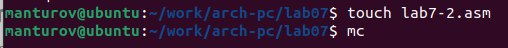{#fig:008 width=70%}

Создадим исполняемый файл и проверим его работу для разных значений B.(@fig:009)

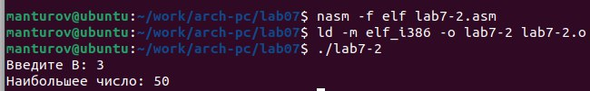{#fig:009 width=70%}

7. Обычно nasm создаёт в результате ассемблирования только объектный файл. Получить
файл листинга можно, указав ключ -l и задав имя файла листинга в командной строке.
Создадим файл листинга для программы из файла lab7-2.asm(@fig:010)

{#fig:010 width=70%}

Откроем файл листинга lab7-2.lst с помощью любого текстового редактора, например
mcedit:(@fig:011)

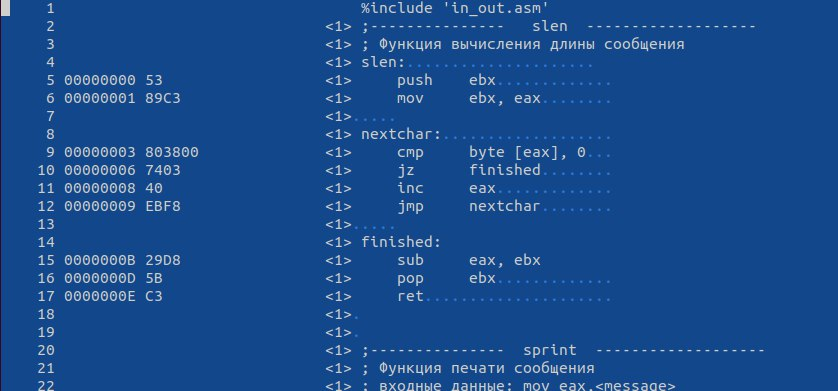{#fig:011 width=70%}

Удалим в файле листинга один операнд и проверим:(@fig:013)

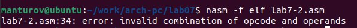{#fig:013 width=70%}

# Выполнение самостоятельной работы

(Вариант №20)
1. Напишем программу нахождения наименьшей из 3 целочисленных переменных a,b и c.
Значения переменных выберем из табл. 7.5 в соответствии с вариантом, полученным
при выполнении лабораторной работы № 6. Создадим исполняемый файл и проверим
его работу.(@fig:015)

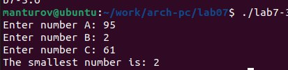{#fig:014 width=70%}

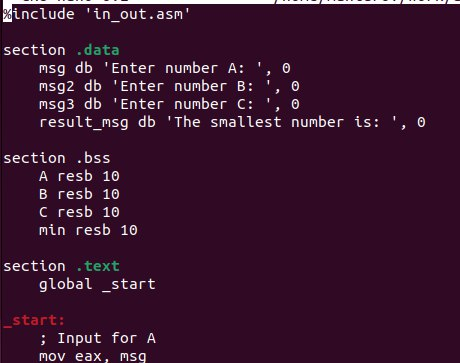{#fig:015 width=70%}

2. Напишите программу, которая для введенных с клавиатуры значений x и a вычисляет
значение заданной функции f(x) и выводит результат вычислений. Вид функции f(x)
выбрать из таблицы 7.6 вариантов заданий в соответствии с вариантом, полученным
при выполнении лабораторной работы № 7. Создайте исполняемый файл и проверьте
его работу для значений x и a из 7.6.(@fig:018)

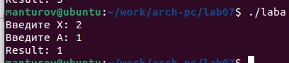{#fig:016 width=70%}

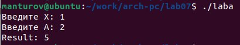{#fig:017 width=70%}

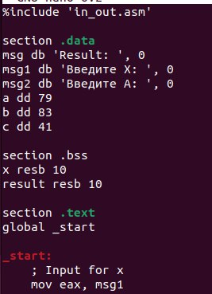{#fig:018 width=70%}

# Выводы

Я изучил команды условного и безусловного переходов. Приобрел навыки написания
программ с использованием переходов. Ознакомился с назначением и структурой файла
листинга.

